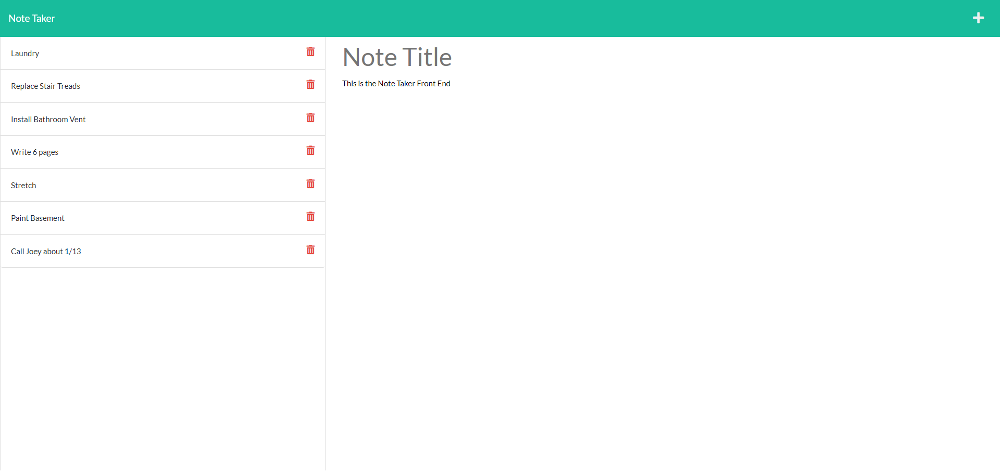

# note_taker
# 11 Express.js: Note Taker

## Table of Contents
- [Description](#description)
- [User Story](#user-story)
- [Acceptance Criteria](#acceptance-criteria)
- [Table of Contents](#table-of-contents)
- [Installation](#installation)
- [Usage](#usage)
- [Tests](#tests)
- [Questions](#questions)


## Description
  
A HTML based app with a server back end that allows the user to input a note with a name and description. It can then be saved to a server db.json file so it persists until the user removes the note by clicked the appripriate icons.

 </br></br>[CLICK HERE -- For the Deployed Site]()  
  


## User Story
  
```
AS A small business owner
I WANT to be able to write and save notes
SO THAT I can organize my thoughts and keep track of tasks I need to complete
```
  

## Acceptance Criteria
  
``` 
GIVEN a command-line application that accepts user input
WHEN I am prompted for my team members and their information
THEN an HTML file is generated that displays a nicely formatted team roster based on user input
WHEN I click on an email address in the HTML
THEN my default email program opens and populates the TO field of the email with the address
WHEN I click on the GitHub username
THEN that GitHub profile opens in a new tab
WHEN I start the application
THEN I am prompted to enter the team manager’s name, employee ID, email address, and office number
WHEN I enter the team manager’s name, employee ID, email address, and office number
THEN I am presented with a menu with the option to add an engineer or an intern or to finish building my team
WHEN I select the engineer option
THEN I am prompted to enter the engineer’s 
name, ID,  email, and GitHub username, and I am taken back to the menu
WHEN I select the intern option
THEN I am prompted to enter the intern’s name, ID, email, and school, and I am taken back to the menu
WHEN I decide to finish building my team
THEN I exit the application, and the HTML is generated
```


## Installation 
Run the following commands at the project root directory.</br></br>- `npm i`
  

## Usage 
Run the following commands at the project root directory</br></br>`node server.js`</br>OR</br>`npm start`


## Tests
No Tests included.


## Questions
[Nathan Patnaude](mailto:Nathanpatnaude@gmail.com) , [GitHub Account](https://github.com/Nathanpatnaude)<br />
This Project is on [GitHub: Note_Taker](https://github.com/Nathanpatnaude/note_taker)
